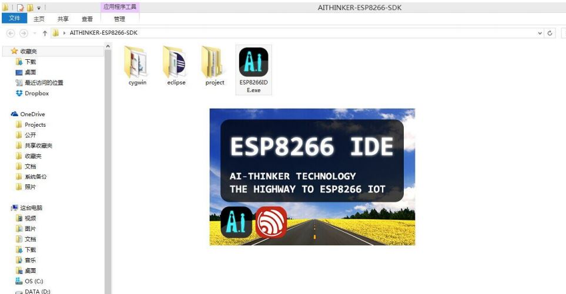
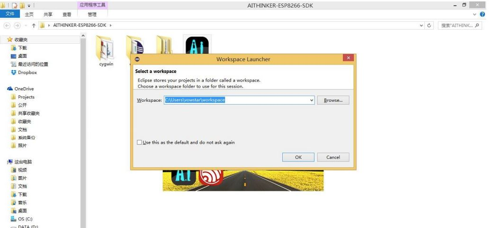
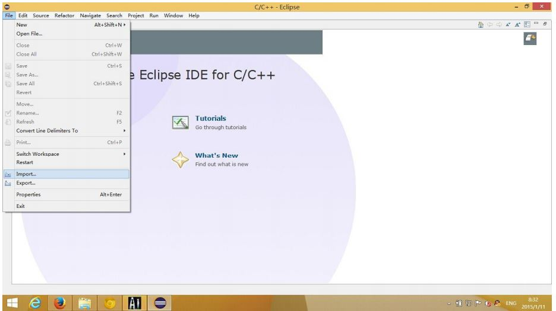
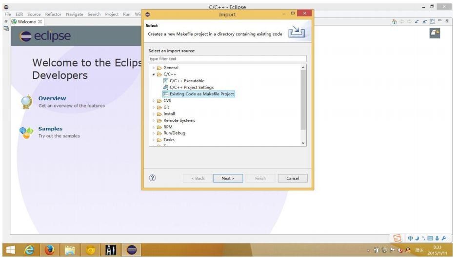
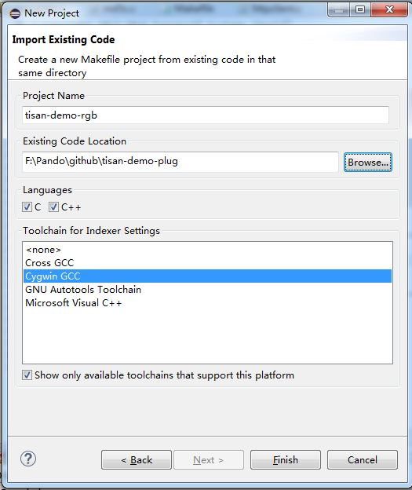
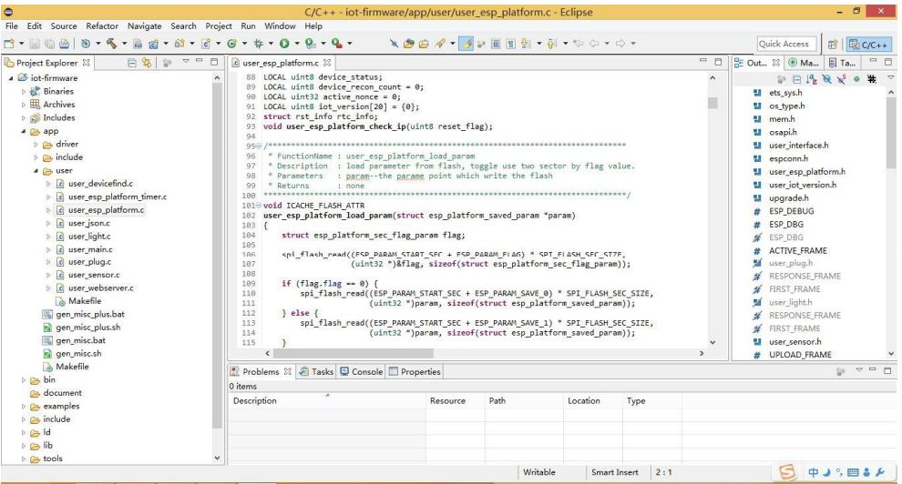
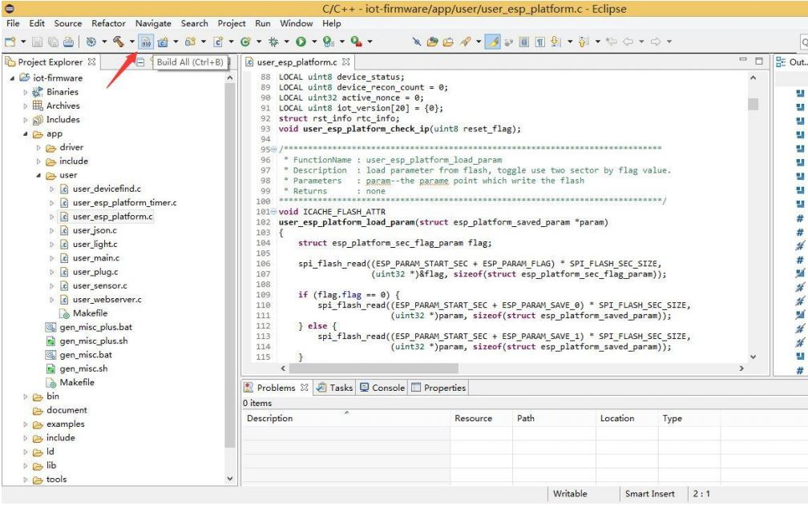
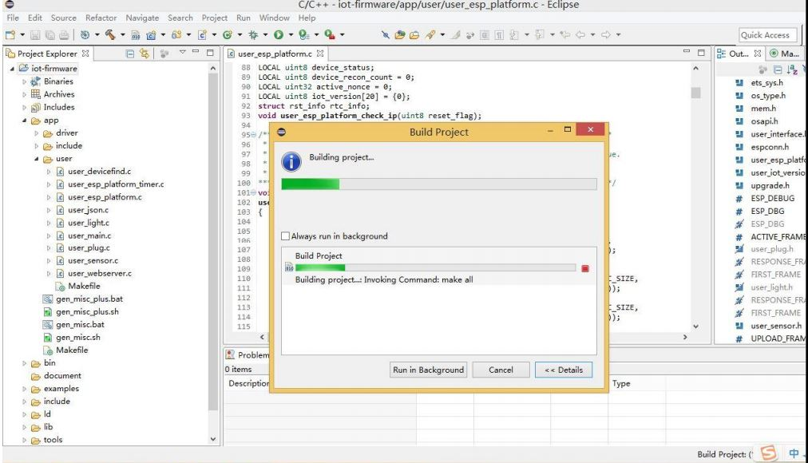
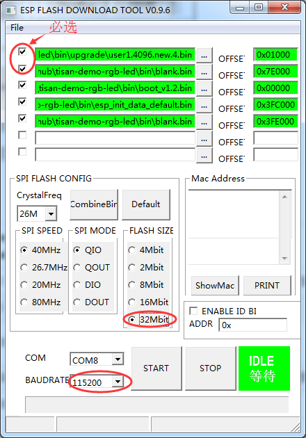
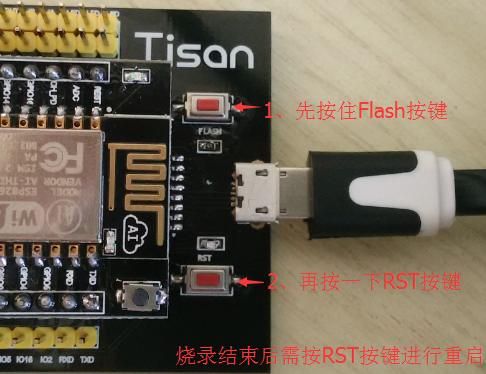

## 导读  
该文档说明**tisan**开发板的开发环境，主要涉及以下内容：  
- 嵌入式IDE编译环境  
- 如何烧写固件  

## IDE编译环境  
可以到这里下载IDE：[**8266_SDK_IDE**](http://yun.baidu.com/s/1sjG2r2P)。  
解压缩后会得到以下文件：  
  
双击**ESP8266IDE**打开：  
  
这是IDE启动界面，需要等一会:)  
选择一个Workspace，然后等进度条走完：  
  

开始，准备导入工程，点击右上角的File：  
  
在Import界面选择**C/C++**下面的**Existing Code as Makefile Project**  
  
在Import现有代码的界面浏览选择要编辑/编译的工程，并在**Toolchain for Indexer Settings**里选择**Cygwin GCC**：  
  
好，然后所有高级特性都出来了，比如代码补全、自动代码分析，代码跟踪等。  
  
点击编译按钮，或者按Ctrl+B，编译整个工程：  
  
编译成功成后即生成bin固件，可以到bin/upgrage文件夹中找到bin文件。  
  
 
 

## 如何烧写固件  
  
[烧写软件下载](http://pan.baidu.com/s/1bnyk36n)。    
[USB转串口驱动](http://pan.baidu.com/s/1jGAOLAQ)    

烧写方法如下：  

1. 打开烧写软件：flash_download_tool_v0.9.6_150419.exe;
2. 把bin文件放入对应栏并注意对应地址(参见烧写地址对应表)，需要重新擦写的项请打“√”;  
3. “SPI MODE”处为QIO(默认就是）;  
4. “FLASH SIZE”处改为“32Mbit”;  
5. "COM"选择对应的串口号，波特率选择115200;  
6. 点击“START”，开发板需要按住Flash按键，并同时按一下Reset按键，即可启动烧录；  
7. 烧录结束后，按一下Reset按键后设备即可启动。    

  

    

开发板按键示意图：  
  

烧写地址对应表：  

| bin file | address offset | Remark |  
| -------- | -------------- | ------ | 
| boot_v1.2.bin | 0x00000 |  启动文件，首次使用开发板或者程序异常时需要勾选烧写 |  
| user1.4096.new.4.bin | 0x01000 | 用户程序，必选 |   
| esp_init_data_default.bin | 0x3FC000 | 存储射频相关参数的初始值，首次使用开发板或者程序异常时需要勾选烧写 |    
| blank.bin | 0x3FE000 | 由乐鑫官方提供，首次使用开发板或者程序异常时需要勾选烧写 |  
| blank.bin | 0x7E000 | 框架参数存储区， 必选 |    

